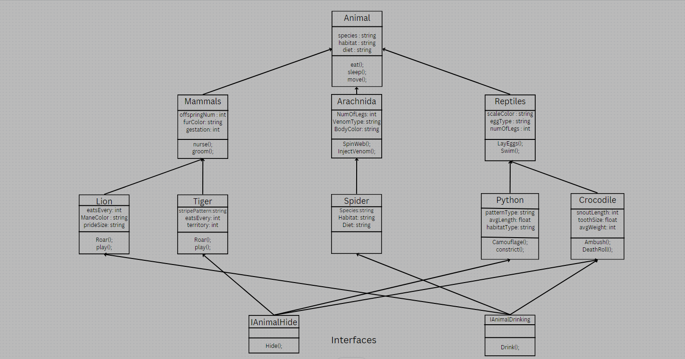

# Virtual Zoo

## intro

this is a virtual zoo console application that demonstartes inheritance in C# by showcasing the animal pyramid

## UML

## Technical Documentation

1. **Encapsulation** was used in the tiger and Lion classes to hide its properties like eats every which were flagged as protected meaning they can be called only using the current class or other derived classes
1. **Inheritance** Animal is my base class. Mammals and reptiles inherit from animal. lion and tiger inherit from Mammals. Inheritance means that the new class takes a copy from the properties and methods included in the old class and are pseudo implemented into the new class
1. **Polymorphism** Mammals has two virtual methods Nurse() and Groom() which can be overridden in derived classes. polymorphism means that one function can take multiple shapes depending on how it was called.tiger.groom(); returns different result to Mammals.Groom();
1. **Abstraction** is where i have a common property or method in base class that i want shared across derived classes and enforce it having values in derived class (abstract method is only completed in derived class not base class)

## whats an interface

in my own words i would say that an interface is same same but different from making a virtual class and inheriting it to a different class with the main difference being that the interfaces are able to have multiple inheritances where as the classes only allow for one inheritance

i implemented 2 interfaces one was IAnimalDrinking which had the purpose of showcasing how different animals drink for example when the interface is implemented in spider you get this "spiders drink the blood of victims not water" but when implemented in the Crocodile class it gives this "Crocodiles are so good at moving without disrupting the water one can be in this river here and i wouldnt know it"

the other interface i implemented was IAnimalHide which does the same as the IAnimalDrinking but for the hiding nature for different animals "Crocodiles are so good at moving without disrupting the water one can be in this river here and i wouldnt know it" but for tigers its "Tigers are so good at hiding when hunting. they can be called one of the best hide and seek players"

